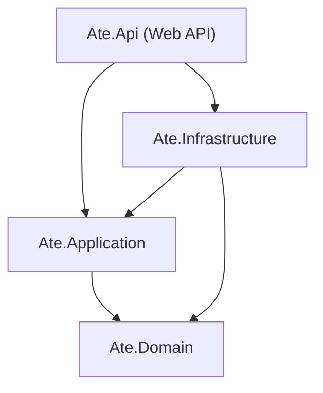

# 🏗️ Ate — Arquitectura del Backend & Especificación de Capas (.NET 10)

> **Propósito:** Este documento sirve como guía oficial de arquitectura para desarrolladores y asistentes de IA. Define la estructura de proyectos, las reglas de **Arquitectura Limpia (Clean Architecture)** y la matriz de referencias entre proyectos (`ProjectReference`).

---

## 📌 1. Visión General de la Solución

El backend de **Ate** está construido sobre **.NET 10 LTS** organizando la lógica del sistema bajo los principios de **Clean Architecture** (Arquitectura Limpia).

* **Solución de .NET:** [Ate.slnx](file:///d:/Ate/backend/Ate.slnx)
* **Directorio raíz del backend:** `d:\Ate\backend\`
* **Estrategia de Configuración & Secretos:** [docs/configuration.md](file:///d:/Ate/backend/docs/configuration.md)

---

## 📁 2. Estructura de Proyectos

```text
d:\Ate\backend\
 ├── Ate.slnx                        --> Solución unificada de .NET 10
 │
 ├── Ate.Domain/                     --> Capa de Dominio (Pura)
 │    └── Ate.Domain.csproj
 │
 ├── Ate.Application/                --> Capa de Casos de Uso y Reglas de Negocio
 │    └── Ate.Application.csproj
 │
 ├── Ate.Infrastructure/             --> Capa de Persistencia e Infraestructura
 │    └── Ate.Infrastructure.csproj
 │
 └── Ate.Api/                        --> Capa de Presentación (Web API / Controllers)
      └── Ate.Api.csproj
```

---

## 🔗 3. Matriz de Referencias entre Proyectos (`ProjectReference`)

En Arquitectura Limpia, **las dependencias apuntan hacia adentro**, siendo el **Dominio** la capa más interna e independiente de todas.



### Detalle de Proyectos y Referencias:

| Proyecto | Tipo | Referencias (`ProjectReference`) | Descripción & Responsabilidad |
| :--- | :--- | :--- | :--- |
| **`Ate.Domain`** | `classlib` | **Ninguna (0 dependencias)** | Contiene las entidades principales (`Empleado`, `Empresa`, `Transaccion`, `Saldo`), Enums, Value Objects y excepciones del dominio. No conoce bases de datos ni APIs. |
| **`Ate.Application`** | `classlib` | `Ate.Domain` | Contiene interfaces (`IApplicationDbContext`, `IJwtProvider`), DTOs, validaciones y servicios de casos de uso. |
| **`Ate.Infrastructure`** | `classlib` | `Ate.Application`, `Ate.Domain` | Implementa el acceso a datos (`DbContext` con Entity Framework Core), repositorios, proveedores de tokens JWT y servicios de códigos QR. |
| **`Ate.Api`** | `webapi` | `Ate.Application`, `Ate.Infrastructure` | Expone los endpoints HTTP REST, configura middlewares (CORS, JWT, Excepciones) y registra las dependencias en el contenedor de IoC. |

---

## 🛠️ 4. Comandos de la CLI de .NET

### Compilar toda la solución:
```bash
dotnet build backend/Ate.slnx
```

### Ejecutar la Web API con recarga en vivo:
```bash
dotnet watch --project backend/Ate.Api/Ate.Api.csproj
```

### Sintaxis para agregar una Referencia de Proyecto (`ProjectReference`):
```bash
dotnet add <ProyectoOrigen.csproj> reference <ProyectoDestino.csproj>
```

---

## 🎯 5. Reglas de Desarrollo para Desarrolladores & IA

1. **Inversión de Dependencias:** La capa `Ate.Application` define las **interfaces**, y `Ate.Infrastructure` implementa dichas interfaces.
2. **Sin dependencias circulares:** Ningún proyecto de capa interna (`Domain` o `Application`) puede hacer referencia a capas externas (`Infrastructure` o `Api`).
3. **Estilo de Código:** Utilizar **TypeScript/C# con tipado estricto**, manejo de nulos habilitado (`<Nullable>enable</Nullable>`) y registros `record` o clases inmutables cuando aplique.
