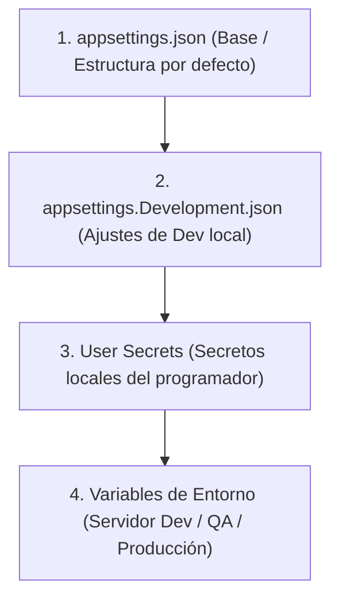

# 🔐 Ate — Guía de Configuración, Secretos & Variables de Entorno (.NET 10)

> **Propósito:** Este documento especifica la estrategia oficial de gestión de configuración, variables de entorno y claves secretas para el proyecto **Ate** en entornos Local, Desarrollo (Dev), Staging y Producción.

---

## 🌊 1. Jerarquía de Configuración en Cascada (.NET Configuration)

ASP.NET Core utiliza un sistema de proveedores de configuración en cascada. Cada nivel **sobrescribe** los valores definidos en los niveles anteriores.



---

## 🛡️ 2. Comparativa de Herramientas y Reglas de Seguridad

| Nivel | Herramienta | ¿Se sube a Git? | Uso Correcto & Contenido |
| :--- | :--- | :--- | :--- |
| **1** | **`appsettings.json`** | **SÍ** | Estructura base del sistema, nombres de sección, timeouts, expiación de tokens (placeholders o valores públicos). |
| **2** | **`launchSettings.json`** | **SÍ** | Configuración de puertos de ejecución local (`http://localhost:5000`) y variable de entorno local (`ASPNETCORE_ENVIRONMENT=Development`). **NUNCA incluir passwords ni claves aquí**. |
| **3** | **`User Secrets`** 🏆 | 🔒 **NUNCA** | **Secretos locales en tu máquina**. Secret Keys de JWT, passwords de bases de datos locales y claves API privadas. |
| **4** | **`Variables de Entorno`** | 🔒 **NUNCA** | **Secretos en servidores reales** (Docker, Kubernetes, AWS, Azure, Railway, etc.). |

---

## 🛠️ 3. Uso de User Secrets (`dotnet user-secrets`) en Entorno Local

Los `User Secrets` **viven fuera del repositorio Git** en el directorio de usuario de tu máquina (`%APPDATA%\Microsoft\UserSecrets\b1322845-5540-4622-a6fd-08bc7b810f97\secrets.json`).

### Comandos de Terminal CLI:

#### Guardar una Secret Key o Cadena de Conexión:
```bash
dotnet user-secrets set "JwtSettings:SecretKey" "Tu_Clave_Secret_Local_Super_Segura_2026" --project backend/Ate.Api/Ate.Api.csproj
```

#### Guardar la Cadena de Conexión de la BD Local:
```bash
dotnet user-secrets set "ConnectionStrings:DefaultConnection" "Host=localhost;Database=ate_db;Username=postgres;Password=tu_password_local" --project backend/Ate.Api/Ate.Api.csproj
```

#### Listar todos los secretos guardados en tu máquina:
```bash
dotnet user-secrets list --project backend/Ate.Api/Ate.Api.csproj
```

---

## 🚀 4. Despliegue a Servidores Dev / Staging / Producción

Para desplegar la aplicación en servidores remotos o contenedores Docker, **NO se requiere cambiar una sola línea de código**. 

Los servidores leen las **Variables de Entorno** del sistema operativo, las cuales sobrescriben los valores de `appsettings.json` mediante el separador de doble guion bajo `__`:

### Mapeo de Variables de Entorno en Servidores:

| Clave en C# / `appsettings.json` | Variable de Entorno en Servidor (Dev / Prod) |
| :--- | :--- |
| `JwtSettings:SecretKey` | `JwtSettings__SecretKey="ClaveSeguraProd2026..."` |
| `ConnectionStrings:DefaultConnection` | `ConnectionStrings__DefaultConnection="Host=db.prod;Database=ate_prod;..."` |
| `JwtSettings:ExpirationInMinutes` | `JwtSettings__ExpirationInMinutes="120"` |

---

## 📋 5. Resumen de Flujo para Desarrolladores & IA

1. **En Local:** Trabajar con `appsettings.json` para la estructura y configurar tus claves privadas usando `dotnet user-secrets set`.
2. **Al hacer Push / Commit:** El archivo `.gitignore` protege automáticamente contra la subida de claves secretas.
3. **En CI/CD o Servidores:** Definir las variables de entorno `JwtSettings__SecretKey` y `ConnectionStrings__DefaultConnection` en el panel del servidor.
